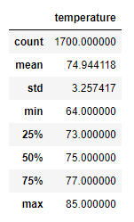
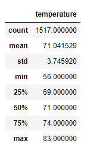

# Surfs Up Analysis

## Project Overview
This project entails conducting a weather analysis for the island of Oahu for an entreprenuer.  In order to obtain backing for a Surf and Shake shop on the island, an investor requests a weather analysis from the entreprenuer to aid in determining the viability of the investment.

## Purpose
The purpose of the project is to provide information on temperature trends for the months of June and December for the island of Oahu.  This will help potential investors determine if the surf and ice cream shop business would be sustainable year round.

## Resources
Software: Python version 3.7.10, SQLAlchemy,

Data Sources: hawaii.sqlite database, 

## Results - bulleted list addressing 3 key differences in weather between June and Dec
Utilizing SQLAlchemy, we are able to extract temperature data for June and December from the Measurements table.  Then after converting the extracted data to a list, we can easily create dataframes for each of the months' data and take a look at the statistics.

June Temperatures                                       December Temperatures

       

Some key differences between the two months include:
 - Average Temperature:  The average temperature for June is 75 degrees but December is slightly cooler with an average temperature of 71 degrees.
 - Maximum Temperature:  The maximum temperatures for both months are very similiar.  June's max temperature is 85 degrees and December is 83 degrees.
 - Minimum Temperature:  The greatest difference between the two months is in this category.  June's minimum temperature is 64 degrees but December's is down to 56 degrees, which may not be the most conducive for ice cream or surfing.

## Summary - high level summary of the results and provide 2 more additional queries to perform to gather more weather data for June and Dec